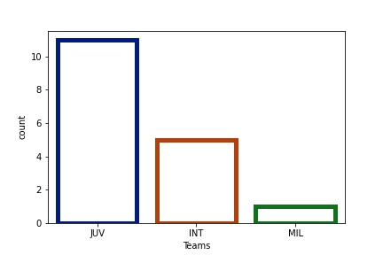
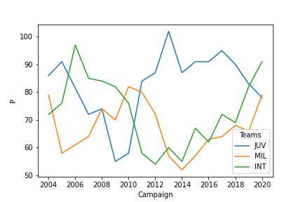
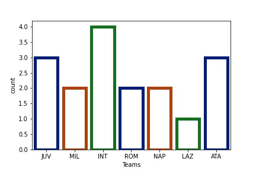
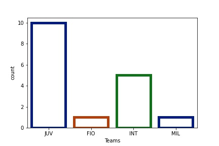
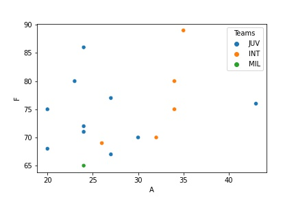
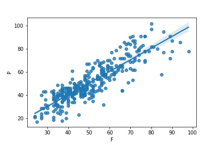
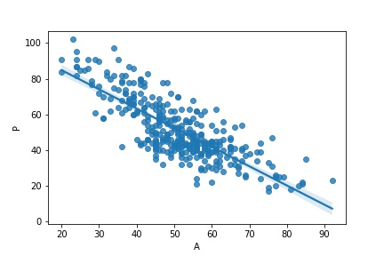

# Serie A Report

# Understanding the Historical Performance of the Past 17 Years

## Out of 39 teams that have participated through the 17 seasons, only 3 have won the Scudetto

Juventus is the absolute leader with 11 wins, followed by Inter (5) and Milan (1).

## Juventus performance is completely opposite to Inter's and Milan's

When Juve does well, the other two don't and viceversa.

## Behind Juventus' success, it hasn't been scoring goals but conceding the least the most important strategy

The following graph shows the number of times a team has been Capocannoniere per season.

The next one the number of times a team has conceded the least goals per season.

Top 3 scuetto winners goals scored (F) and goals conded (A) evolution through campaigns

## Now, for the league overall, scoring goals has been slightly more determinant than no conceding when it comes to accumulating points

R2 = 0.76

R2 = 0.63

# Conclusion

### It is not the one who scores the most who wins but the one who balances between scoring and conceding the least.

